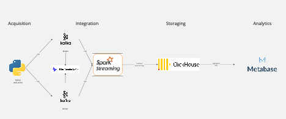

# About

This is a pet-project to play with distributed systems instruments. The idea is to implement data processing online pipeline.

Plot: move logs, joined with information about A/B experiment selections from server to DWH. Then calculate metrics for A/B experiments.

# How to run

1. Simply, run docker compose.
    ```bash
    sudo docker compose up
    ```
2. Create a table in db using script `clickhouse_connection_test.py`. To run it you need to install `python3.11` and `clickhouse_connect` lib.
    ```bash
   python3 clickhouse_connection_test.py
    ```
3. Create dashboards in MetaBase ui and check the results. Here is a simple sql query to visualize.
   ```sql
   SELECT * FROM todo;
   ```

# Project description



Python script is emulating product service, that generates logs. It creates random information about purchases and "splits" traffic for A/B experiments.

Kafka simply stores logs. There are also kafka-ui to check kafka's state, and zookeeper to store kafka's broker information. Kafka has two brokers.

Spark structured streaming server gets logs from kafka, processes them a little and saves to ClickHouse DWH.

ClickHouse simply stores data and processes aggregation requests from UI.

MetaBase performs requests to ClickHouse data and shows results to the user in UI.

Find more information in word file with project report, power point presentation and docker compose file.


# What to do next?

- Improve docs, run guide. Include dashboards and table creation into docker. 
- Play with k8s, deploy the system on cloud.
- Make system truly scalable (automatically increase amount of workers, brokers). 
- Add airflow DAG with common spark workers cluster to process data deeply.